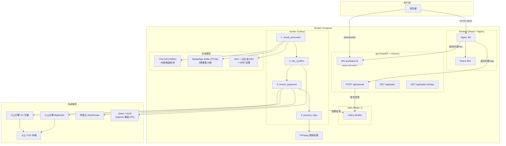
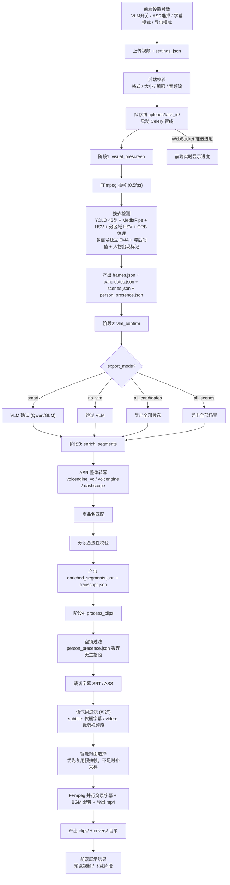

# 直播视频 AI 智能剪辑

一键将直播录像自动拆分为商品讲解短视频片段，支持烧录字幕、karaoke 逐字高亮、语气词过滤、智能封面选择、BGM 自动选曲和视频变速。上传 MP4，AI 自动识别换衣节点、转写语音、匹配商品名、导出短视频。

## 系统架构



## 处理流程



## 功能特性

- **上传** -- 支持 20GB 以内 MP4，自动校验编码格式和音频流
- **换衣检测** -- 五信号联合：YOLO 46类服装检测 + MediaPipe 像素分割 + 全帧 HSV + 分区域 HSV（上身/下身）+ ORB 纹理；多信号独立 EMA 平滑 + 滞后阈值状态机，任一信号触发即可检测到换衣
- **空镜过滤** -- 换衣检测阶段记录每帧人物出现标记，导出时两层过滤：(1) 段内人物出现率 < 60% 丢弃；(2) 开头连续无人 ≥ 8 秒丢弃
- **VLM 确认** -- 支持 Qwen / GLM 两种 Provider，按导出模式决定是否参与
- **多 ASR 支持** -- 火山 VC 字幕（推荐）、火山 BigModel、阿里 DashScope，三选一
- **商品匹配** -- 自动关联商品名称与讲解片段
- **LLM 文本分析** -- 可选开启，用 LLM 分析字幕文本识别换品边界，与视觉检测信号两层树融合（Level 0 换装区间 + Level 1 商品讨论段），按切分粒度（单品/搭配）导出
- **句边界对齐** -- 将片段起止时间对齐到 ASR 句子边界，避免截断半句话，默认开启
- **字幕烧录** -- 支持四种模式：off / basic / styled / karaoke（逐字高亮+弹跳动画），支持自定义位置
- **导出模式** -- smart / no_vlm / all_candidates / all_scenes
- **实时进度** -- WebSocket 推送处理进度，前端实时展示
- **历史记录** -- 分页列表查看所有历史任务，支持状态筛选、展开查看片段、删除
- **语气词过滤** -- 三级词表（38词），支持仅过滤字幕或同时裁剪视频片段，默认关闭
- **智能封面** -- content_first（商品优先）/ person_first（主播优先），最多 30 帧评分选最佳；优先复用 visual_prescreen 已抽帧，不足时再用 FFmpeg 补足候选，COCO YOLO 遮挡检测自动排除手机等遮挡帧
- **视频变速** -- 0.5x~3x 倍速，先烧字幕再变速，默认 1.25x
- **并发处理** -- cgroup-aware 资源检测，ThreadPoolExecutor 并行处理多 clip，4GB 容器通常约 3 workers（由 CPU/内存实时计算）
- **BGM 自动选曲** -- 双库架构（内置曲库+用户上传），按商品类型自动匹配背景音乐，用户曲目优先，跨 clip 去重，前端支持拖拽上传/编辑标签/删除

## 技术栈

| 层级 | 技术 |
|------|------|
| 前端 | React 19 + TypeScript 6 + Vite 8 + Tailwind CSS 4 + Zustand 5 |
| 后端 API | FastAPI + Uvicorn |
| 异步任务 | Celery + Redis |
| 换衣检测 | YOLOv8 (ONNX, 46类) + MediaPipe Selfie (TFLite, 6类) + HSV + 分区域 HSV + ORB 纹理 + 多信号独立 EMA + 滞后阈值 |
| VLM | Qwen / GLM (OpenAI 兼容 API) |
| ASR | 火山 VC 字幕 (推荐) / 火山大模型 / 阿里 DashScope |
| 视频处理 | FFmpeg |
| 容器化 | Docker Compose (4 services) |

## 快速开始

### 前置条件

- Docker Desktop / Docker + Docker Compose
- 16GB 内存 + 8 核 CPU（Worker 限制 4GB）
- 无需 GPU（CPU 模式运行）

### 部署步骤

```bash
# 1. 克隆项目
git clone <repo-url>
cd 直播视频剪辑_GLM

# 2. 配置环境变量
cp .env.example .env
# 编辑 .env，填入 VLM API Key 和 ASR 相关配置

# 3. 一键启动
docker compose up -d

# 4. 访问应用
# 前端：http://127.0.0.1:5537
# 后端 API 文档：http://127.0.0.1:5538/docs
```

### 获取 API Key

| 服务 | 用途 | 获取地址 |
|------|------|----------|
| 阿里云 DashScope | VLM (Qwen) / ASR | [DashScope 控制台](https://dashscope.console.aliyun.com/) |
| 智谱开放平台 | VLM (GLM) | [智谱开放平台](https://open.bigmodel.cn/) |
| 火山引擎 | ASR (BigModel / VC) | [火山引擎控制台](https://console.volcengine.com/) |

## 配置说明

编辑 `.env` 文件进行配置。只列出 Docker Compose 实际使用的变量：

### VLM 配置

| 变量 | 说明 | 默认值 |
|------|------|--------|
| `VLM_API_KEY` | VLM API Key | 空 |
| `VLM_BASE_URL` | VLM API 地址 | `https://dashscope.aliyuncs.com/compatible-mode/v1` |
| `VLM_MODEL` | VLM 模型名称 | `qwen-vl-plus` |

### 基础设施

| 变量 | 说明 | 默认值 |
|------|------|--------|
| `REDIS_URL` | Redis 连接地址 | `redis://redis:6379/0` |
| `HF_ENDPOINT` | Hugging Face 镜像（下载模型用） | `https://hf-mirror.com` |

### 国内镜像加速（可选）

| 变量 | 说明 | 默认值 |
|------|------|--------|
| `DOCKER_REGISTRY` | Docker 基础镜像前缀 | 空 |
| `APT_MIRROR` | Debian APT 镜像源 | 空 |
| `PYPI_INDEX_URL` | Python PyPI 镜像源 | 空 |
| `NPM_REGISTRY` | Node.js NPM 镜像源 | 空 |

### 火山引擎 / TOS 配置

| 变量 | 说明 | 默认值 |
|------|------|--------|
| `VOLCENGINE_ASR_API_KEY` | 火山引擎 ASR API Key | 空 |
| `TOS_AK` | 火山 TOS Access Key | 空 |
| `TOS_SK` | 火山 TOS Secret Key | 空 |
| `TOS_BUCKET` | TOS Bucket 名称 | `mp3-srt` |
| `TOS_REGION` | TOS Region | `cn-beijing` |
| `TOS_ENDPOINT` | TOS Endpoint | `tos-cn-beijing.volces.com` |

### LLM 文本分析配置

| 变量 | 说明 | 默认值 |
|------|------|--------|
| `LLM_API_KEY` | LLM API Key | 空 |
| `LLM_API_BASE` | LLM API 地址 | 空 |
| `LLM_MODEL` | LLM 模型名称 | 空 |
| `LLM_TYPE` | API 类型 | `openai` |

### ASR 配置

ASR 的 Provider 选择和 API Key 在 **前端设置页面** 中配置，保存在浏览器 localStorage，随上传任务一起提交到后端。后端凭据（TOS AK/SK 等）通过 `.env` 环境变量注入。

## 项目结构

```
直播视频剪辑_GLM/
├── docker-compose.yml            # Docker 编排 (4 services)
├── .env.example                  # 环境变量模板
├── CLAUDE.md                     # 项目真实状态文档
├── backend/
│   ├── Dockerfile                # Python 3.11 + FFmpeg, 多阶段构建
│   ├── requirements.txt          # Python 依赖
│   ├── assets/
│   │   ├── fonts/                # 字幕字体
│   │   ├── models/               # 本地模型文件
│   │   │   ├── selfie_multiclass_256x256.tflite  # MediaPipe 6类像素分割
│   │   │   ├── yolov8n-fashionpedia.onnx          # YOLO 46类服装检测
│   │   │   └── yolov8n.onnx                       # COCO YOLO 80类 (封面遮挡检测)
│   │   ├── default_bgm.mp3       # 默认背景音乐
│   │   ├── bgm/                  # 音乐库
│   │   │   ├── bgm_library.json  # 音乐库索引 (mood/category 映射)
│   │   │   └── *.mp3             # 音乐文件
│   │   └── watermark.png         # 水印图片
│   ├── app/
│   │   ├── main.py               # FastAPI 入口
│   │   ├── api/                  # API 路由
│   │   │   ├── health.py         # 健康检查
│   │   │   ├── upload.py         # 视频上传
│   │   │   ├── tasks.py          # 任务 CRUD + WebSocket + 诊断 + 审核 + 重试 + 重处理
│   │   │   ├── clips.py          # 片段列表 / 下载 / 批量下载 / 缩略图
│   │   │   ├── settings.py       # 设置模型与校验
│   │   │   ├── music.py          # 音乐库 API
│   │   │   ├── assets.py         # 跨任务素材资产浏览
│   │   │   └── system.py         # 系统资源监控
│   │   ├── services/             # 业务逻辑
│   │   │   ├── clothing_change_detector.py   # 换衣检测 (主链路)
│   │   │   ├── clothing_segmenter.py         # 服装分段 (主链路)
│   │   │   ├── frame_extractor.py            # FFmpeg 抽帧
│   │   │   ├── scene_detector.py             # 场景检测
│   │   │   ├── vlm_confirmor.py              # VLM 二次确认
│   │   │   ├── vlm_client.py                 # VLM API 客户端
│   │   │   ├── vlm_parser.py                 # VLM 结果解析
│   │   │   ├── dashscope_asr_client.py       # DashScope ASR
│   │   │   ├── volcengine_asr_client.py      # 火山 BigModel ASR
│   │   │   ├── volcengine_vc_client.py       # 火山 VC 字幕 ASR
│   │   │   ├── transcript_merger.py          # 转写结果合并
│   │   │   ├── product_matcher.py            # 商品名匹配
│   │   │   ├── segment_validator.py          # 分段合法性校验
│   │   │   ├── srt_generator.py              # SRT/ASS 字幕生成
│   │   │   ├── ffmpeg_builder.py             # FFmpeg 命令构建
│   │   │   ├── state_machine.py              # 任务状态机
│   │   │   ├── validator.py                  # 通用校验
│   │   │   ├── error_handler.py              # 错误处理
│   │   │   ├── cleanup.py                    # 清理工具
│   │   │   ├── filler_filter.py              # 语气词过滤
│   │   │   ├── cover_selector.py             # 智能封面选择
│   │   │   ├── bgm_selector.py              # BGM 自动选曲
│   │   │   ├── resource_detector.py          # 容器资源检测
│   │   │   ├── siglip_encoder.py             # [legacy] FashionSigLIP 编码
│   │   │   ├── adaptive_similarity.py   # [legacy] 自适应相似度
│   │   │   ├── text_segment_analyzer.py        # LLM 文本边界分析
│   │   │   ├── segment_fusion.py               # 两层树信号融合
│   │   │   ├── boundary_snapper.py             # 句边界对齐
│   │   │   └── boundary_refiner.py             # LLM 边界精修
│   │   └── tasks/
│   │       └── pipeline.py        # Celery 四阶段管线 + 单片段重处理
│   └── tests/                     # 28 个测试文件
└── frontend/
    ├── Dockerfile                 # Node 20 构建 + Nginx 运行
    ├── nginx.conf                 # Nginx (20G 上传 + WebSocket)
    ├── src/
    │   ├── App.tsx                # 入口，渲染 AdminDashboard
    │   ├── components/
    │   │   ├── AdminDashboard.tsx # 主应用壳（330 行，8 页状态机）
    │   │   ├── admin/             # 拆分后的子模块
    │   │   │   ├── api.ts         # API 调用封装
    │   │   │   ├── types.ts       # 类型定义
    │   │   │   ├── format.ts      # 格式化工具
    │   │   │   ├── constants.tsx  # 常量
    │   │   │   ├── shared.tsx     # 共享 UI 组件
    │   │   │   └── pages/         # 8 个页面组件
    │   │   │       ├── ProjectManagementPage.tsx
    │   │   │       ├── CreateProjectPage.tsx
    │   │   │       ├── QueuePage.tsx
    │   │   │       ├── ReviewPage.tsx
    │   │   │       ├── AssetsPage.tsx
    │   │   │       ├── MusicPage.tsx
    │   │   │       ├── DiagnosticsPage.tsx
    │   │   │       └── SettingsPage.tsx
    │   │   ├── SettingsPage.tsx   # 独立设置页面（备选入口）
    │   │   ├── MusicPage.tsx      # 独立音乐库页面（备选入口）
    │   │   ├── HistoryPage.tsx    # 独立历史记录页面（备选入口）
    │   │   ├── UploadZone.tsx     # 拖拽上传区域
    │   │   ├── ProgressBar.tsx    # 管线进度条（8 阶段）
    │   │   ├── ResultGrid.tsx     # 片段结果网格
    │   │   ├── VideoPreview.tsx   # 视频预览弹窗
    │   │   ├── ErrorCard.tsx      # 错误卡片
    │   │   ├── ToastViewport.tsx  # Toast 通知
    │   │   └── ui/dialog.tsx      # 自定义 Dialog 组件
    │   ├── hooks/
    │   │   └── useWebSocket.ts    # WebSocket 进度推送
    │   ├── stores/
    │   │   ├── settingsStore.ts   # 设置状态（44 字段, localStorage）
    │   │   ├── taskStore.ts       # 任务状态
    │   │   └── toastStore.ts      # 通知状态
    │   └── lib/
    │       └── utils.ts           # cn() 工具函数
    └── package.json
```

## 服务说明

| 服务 | 端口 | 说明 | 内存限制 |
|------|------|------|----------|
| frontend | 5537 | React SPA + Nginx 反向代理 | 默认 |
| api | 5538 | FastAPI + Uvicorn | 2G |
| worker | -- | Celery 异步任务 (concurrency=1, 并行 clip 处理) | 4G |
| redis | 6379 | 消息队列 + 结果存储 | 默认 |

## LLM 文本分析效果对比

同一视频（20 分钟直播录像），分别用「仅视觉检测」和「视觉 + LLM 文本分析」跑出的分段对比：

### 仅视觉检测（LLM 关闭）

| # | 时间段 | 置信度 | 商品名 |
|---|--------|--------|--------|
| 1 | 30s - 78s | 0.014 | 未命名商品 |
| 2 | 222s - 248s | 0.144 | 未命名商品 |
| 3 | 302s - 340s | 0.173 | 裙子还其实蛮难做 |
| 4 | 492s - 522s | 0.358 | 未命名商品 |
| ... | ... | ... | 全部 low_confidence |

问题：边界全靠衣服颜色变化检测，漏掉了很多换品节点，商品名基本匹配不上。

### 视觉 + LLM 文本分析（LLM 开启）

| # | 时间段 | 置信度 | 商品名 | 来源 |
|---|--------|--------|--------|------|
| 1 | 141s - 253s | 0.95 | 丘比特毛衣（马海毛+绵羊毛） | visual+text |
| 2 | 253s - 333s | 0.95 | 后花园精纺羊毛开衫 | visual+text |
| 3 | 333s - 444s | 0.95 | 蓝色系带花边上衣 | visual+text |
| 4 | 444s - 519s | 0.90 | 肉粉色小露肩雪纺衫 | visual+text |
| 5 | 577s - 630s | 0.90 | 橘色两件套及绿色勾花背心 | visual+text |
| 6 | 714s - 930s | 0.95 | 蓝色绣花球木耳边毛衣 | visual+text |
| 7 | 972s - 1069s | 0.98 | 蕾丝美背/内搭吊带 | text |
| ... | ... | ... | ... | ... |

**核心差异**：
- **边界精准度**：LLM 通过"第一个"、"第二个"、"先上这款"等主播话术精确定位换品时刻，比纯视觉检测准确得多
- **商品名识别**：LLM 从讲解内容中提取商品名（"丘比特毛衣"、"后花园开衫"），不再是"未命名商品"
- **漏检修复**：纯视觉漏掉的换品（主播换了搭配但衣服颜色相近），LLM 通过文本语义可以补上
- **置信度提升**：从 0.01~0.35 提升到 0.85~0.98

**推荐**：对分段准确度有要求的场景建议开启 LLM 文本分析。仅做粗切或对成本敏感时可关闭。

## ASR 对比

三款 ASR 实测对比（同一段 20 分钟直播视频，karaoke 字幕模式）：

| 维度 | `volcengine_vc`（推荐） | `volcengine`（BigModel） | `dashscope`（paraformer-v2） |
|------|------------------------|-------------------------|------------------------------|
| 分句数 | 796 | 403 | 267 |
| 平均句长 | 1.5s | 2.7s | 4.5s |
| 逐字时间戳 | ✅ 真实语音节奏 | ✅ 真实时间戳 | ❌ 匀速伪时间戳（~0.272s/字） |
| 分句质量 | ✅ 剪映引擎智能分句，语义完整 | ⚠️ 中文无词边界，会拆词折行（如"雪/纺"） | ⚠️ 句子偏长，换气点切分不准 |
| Karaoke 跳字同步 | ✅ 最好，句尾字自然拖长 | ⚠️ 同步还行，但拆词影响观感 | ❌ 完全不同步，匀速跳字 |
| basic/styled 字幕 | ✅ 好 | ✅ 好 | ✅ 好 |
| 价格（后付费） | ¥6.5/小时 | ¥2.3/小时 | ~¥0.29/小时 |
| 免费额度 | 20 小时 | 20 小时 | 有 |
| 接入方式 | submit+poll，需 TOS 上传 | submit+poll / flash 单次请求 | 直接传 MP4 |

### 选型建议

- **karaoke 逐字跳动字幕**：必须选 `volcengine_vc`，其他两款的时间戳质量不够
- **basic/styled 普通字幕**：三款都可以，`dashscope` 最便宜
- **预算充裕 + 质量优先**：`volcengine_vc` 无脑选
- **预算有限 + 只做普通字幕**：`dashscope` 性价比最高

## 字幕模式

| 模式 | 格式 | 说明 |
|------|------|------|
| `off` | -- | 不生成字幕 |
| `basic` | SRT | 普通字幕烧录 |
| `styled` | SRT | 带样式的字幕烧录 |
| `karaoke` | ASS | 逐词/逐字高亮，当前词带三段弹跳动画 (130% -> 105% -> 100%) |

karaoke 模式的实现要点：
- base 层用 `\kf` 逐字高亮，overlay 层逐字跳动叠加
- 80ms 最小视觉间隙，避免字幕跳句
- 被截断的 segment 自动加淡出效果
- 多字 word 用加权分字（首字 1.3x、末字 0.7x）模拟自然语音

## BGM 自动选曲

双库架构（内置曲库 + 用户上传），根据商品类型自动为每个 clip 选择最合适的背景音乐，用户曲目优先选曲。

### 选曲逻辑

1. 从 segment 的 `product_type` 或 `product_name` 推断商品类型（上衣、裙装、外套等）
2. 通过 `category_defaults` 映射获取首选 mood 列表（如上衣→happy/uplifting，裙装→calm/romantic）
3. 在合并曲库中筛选 category 或 mood 匹配的曲目
4. 跨 clip 去重（`used_bgm_ids`），优先选未使用的曲目
5. 无匹配时 fallback 到全曲库；曲库为空时 fallback 到 `default_bgm.mp3`
6. 用户曲目优先于内置曲目被选中

### 用户可控设置

| 设置 | 说明 | 默认值 |
|------|------|--------|
| `bgm_enabled` | 是否开启背景音乐 | `true` |
| `bgm_volume` | BGM 音量（0-1） | 0.25 |
| `original_volume` | 原声音量（0-2） | 1.0 |

### 用户音乐库（前端上传）

前端 `/music` 页面支持：

- **拖拽上传** MP3 文件（20MB 以内），自动校验格式和提取时长
- **标签编辑**：上传后弹出编辑框，可设置标题、情绪标签（12种）、适用分类（10种）、节奏、能量
- **删除管理**：仅用户上传的曲目可编辑/删除，内置曲目只读
- **来源标记**：蓝色"我的"标签标识用户曲目，灰色"内置"标签标识系统曲目

### 扩充内置音乐库

将 MP3 文件放入 `backend/assets/bgm/`，在 `bgm_library.json` 的 `tracks` 数组中追加条目：

```json
{
  "id": "unique_id",
  "file": "filename.mp3",
  "title": "曲目名称",
  "mood": ["happy", "uplifting"],
  "genre": "pop",
  "tempo": "medium",
  "energy": "medium",
  "categories": ["上衣", "日常穿搭"],
  "duration_s": 180.0
}
```

Docker 重建后生效。

## 输出目录

每个任务产出文件：

```
uploads/<task_id>/
├── original.mp4                  # 原始上传视频
├── meta.json                     # 视频元数据
├── settings.json                 # 任务设置
├── state.json                    # 任务状态 (前端轮询)
├── candidates.json               # 候选片段
├── scenes.json                   # 场景检测结果
├── transcript.json               # 完整转写 (含 words 时间戳)
├── enriched_segments.json        # 校验后的片段
├── frames/                       # 临时抽帧目录（process_clips 完成后清理）
│   ├── frames.json               # 预抽帧索引，供封面选择复用
│   └── scene000/frame_*.jpg      # visual_prescreen 抽出的候选帧
├── scenes/
│   ├── person_presence.json      # 每帧人物出现标记 (空镜过滤用)
│   ├── hist_debug.json           # 检测信号调试数据 (EMA 等)
│   └── scenes.json               # 场景分割结果
├── clips/
│   ├── clip_001.mp4              # 导出的短视频
│   ├── clip_001_meta.json        # 片段元数据
│   └── clip_001.ass              # ASS 字幕文件 (karaoke 模式)
└── covers/
    └── clip_001.jpg              # 智能封面缩略图
```

## 性能优化

| 优化项 | 说明 |
|--------|------|
| 并行 clip 处理 | ThreadPoolExecutor 并行处理多 clip，并发数由 cgroup CPU/内存实时计算，4GB 容器通常约 3 workers |
| 封面预抽帧复用 | `visual_prescreen` 写出 `frames/frames.json`，`process_clips` 优先复用已抽帧做封面评分；预抽帧不足时才用 FFmpeg 补足候选，导出完成后递归清理 `frames/` |
| FFmpeg x264 优化 | `rc-lookahead=5:bframes=1:ref=1` 降低每实例 ~100MB 内存 |
| FFmpeg 线程限制 | `-threads 4 -filter_threads 2` 避免内存膨胀 |
| Celery 资源回收 | `--max-tasks-per-child=100 --max-memory-per-child=3GB` |
| 任务超时保护 | 软超时 30min / 硬超时 60min |

实测数据（20 分钟直播视频，9 clips）：

| 阶段 | 串行 | 并行 2w + 优化 | 改善 |
|------|------|---------------|------|
| process_clips | 276s | 195s | -29% |

最新基准（同一 20 分钟 1080x1920 直播视频）：

| 场景 | 关键结果 |
|------|----------|
| 本地隔离链路（VLM/ASR/LLM/BGM/字幕关闭） | 封面选择平均约 `20.16s → 15.87s/clip`，子阶段约 -21%；端到端受 FFmpeg 负载波动影响，不直接宣称整体加速 |
| 完整链路（smart + VLM + volcengine_vc + karaoke + LLM + BGM） | 监控总耗时约 600s；主要瓶颈为 `process_clips=285.08s` 和视觉抽帧+检测约 211.74s |

## 常见问题

### Q: ASR 怎么选？

对字幕质量有要求（特别是 karaoke 模式），选 `volcengine_vc`。只做 basic 字幕、想省钱，选 `dashscope`。不要选 `volcengine`（BigModel 标准版）做 karaoke，中文无词边界会导致拆词折行。

### Q: 上传大文件失败？

确保 nginx 配置了 `client_max_body_size 20G`（已默认配置）。如果使用反向代理，也需要调整代理层的上传限制。

### Q: Worker 内存不足？

Worker 默认内存限制 4GB，配置了 --max-memory-per-child=3GB 自动回收。并发数由 resource_detector.py 根据 cgroup 资源动态计算（4GB 容器默认 2 workers）。处理超长视频时可在 `docker-compose.yml` 中调大 `deploy.resources.limits.memory`。

### Q: 如何查看处理日志？

```bash
docker compose logs -f worker     # 查看任务处理日志
docker compose logs -f api        # 查看 API 日志
docker compose logs -f            # 查看全部日志
```

### Q: 支持哪些视频格式？

目前仅支持 MP4 (H.264 编码)，文件需包含音频流。

### Q: 首次构建为什么慢？

Docker 构建时需要安装 Python 依赖和 FFmpeg。Worker 首次运行时会下载两个本地模型（YOLO ONNX 12MB + MediaPipe TFLite 16MB），通过 `HF_ENDPOINT` 配置镜像源可加速。

## License

MIT
