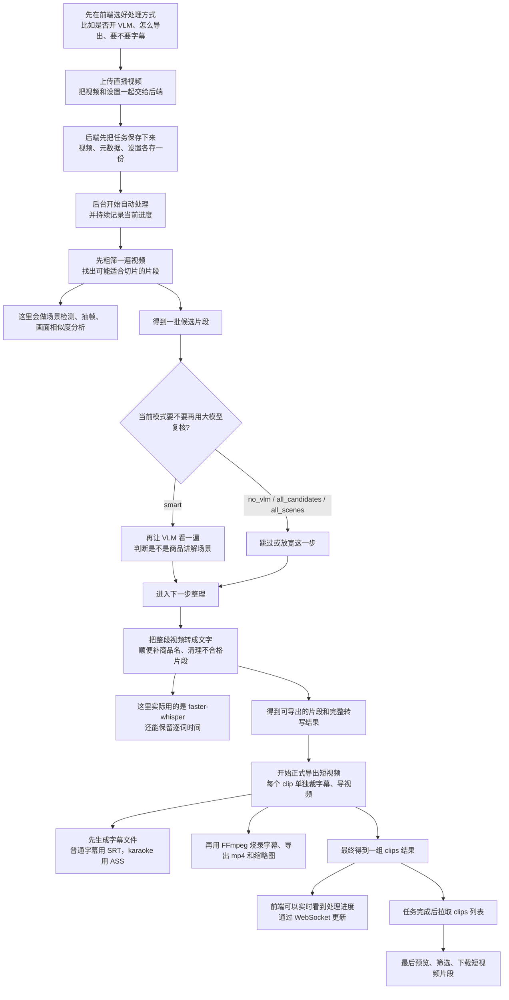

# 直播视频 AI 智能剪辑

一键将直播录像自动拆分为商品讲解短视频片段。上传 MP4 → AI 自动分析 → 预览下载。

## 架构

```
上传视频 → [视觉预筛] → [VLM 确认] → [转写+商品匹配] → [FFmpeg 导出 clips]
  │           │              │                │                    │
  │      FashionSigLIP   Qwen/GLM        faster-whisper       FFmpeg
  │      ONNX Runtime   OpenAI 兼容 API   transcript.json      字幕烧录
  │           │              │                │                    │
  └───────────┴──────────────┴────────────────┴────────────────────┘
                             四段流水线架构
```

## 业务流程图



## 功能特性

- **上传** — 支持 20GB 以内 MP4 文件上传，自动校验编码格式
- **视觉预筛** — FashionSigLIP (ONNX) 提取帧特征，自适应相似度分析筛选候选片段
- **VLM 确认** — 支持 Qwen / GLM 两种 Provider，按导出模式决定是否参与确认
- **语音转写** — 当前主链路使用 `faster-whisper`，输出整段转写和逐词时间戳
- **商品匹配** — 自动关联商品名称与讲解片段
- **视频输出** — FFmpeg 硬编码剪辑，支持普通字幕与 karaoke 字幕烧录
- **实时进度** — WebSocket 推送处理进度，前端实时展示
- **导出模式** — 支持 `smart` / `no_vlm` / `all_candidates` / `all_scenes`
- **字幕模式** — 支持 `off` / `basic` / `styled` / `karaoke`

## 技术栈

| 层级 | 技术 |
|------|------|
| 前端 | React + TypeScript + Vite + Tailwind CSS |
| 后端 | FastAPI + Celery + Redis |
| 视觉模型 | FashionSigLIP (ONNX Runtime CPU) |
| 场景检测 | PySceneDetect + OpenCV |
| 多模态 VLM | Qwen / GLM（OpenAI 兼容 API） |
| 语音识别 | faster-whisper |
| 视频处理 | FFmpeg (系统级安装) |

## 快速开始

### 前置条件

- Docker Desktop / Docker + Docker Compose
- 16GB 内存 + 8 核 CPU
- 无需 GPU（ONNX Runtime CPU 模式）

### 部署步骤

```bash
# 1. 克隆项目
git clone <repo-url>
cd 直播视频剪辑_GLM

# 2. 配置环境变量
cp .env.example .env
# 编辑 .env，填入你的 VLM API Key
# VLM_API_KEY=sk-xxxxxxxxxxxxxxxx

# 3. 一键启动
docker compose up -d

# 4. 访问应用
# 前端：http://127.0.0.1:5537
# 后端 API：http://127.0.0.1:5538/docs
```

### 获取 VLM API Key

1. 如果你使用 Qwen，访问 [阿里云 DashScope 控制台](https://dashscope.console.aliyun.com/)
2. 如果你使用 GLM，访问智谱开放平台并创建对应 API Key
3. 把 API Key 填入 `.env` 的 `VLM_API_KEY`

## 配置说明

编辑 `.env` 文件进行配置：

| 变量 | 说明 | 默认值 |
|------|------|--------|
| `VLM_API_KEY` | Qwen-VL-Plus API Key（必填） | — |
| `VLM_BASE_URL` | VLM API 地址 | `https://dashscope.aliyuncs.com/compatible-mode/v1` |
| `VLM_MODEL` | VLM 模型名称 | `qwen-vl-plus` |
| `REDIS_URL` | Redis 连接地址 | `redis://redis:6379/0` |
| `FASTER_WHISPER_MODEL` | whisper 模型名 | `small` |
| `FASTER_WHISPER_DEVICE` | whisper 设备 | `cpu` |
| `FASTER_WHISPER_COMPUTE_TYPE` | whisper 精度 | `int8` |
| `HF_ENDPOINT` | Hugging Face 镜像 | `https://hf-mirror.com` |

## 常见问题

### Q: 首次转写为什么比较慢？

`faster-whisper` 首次运行需要下载模型或预热缓存，第一次任务通常会比后续任务更慢。

### Q: 上传大文件失败？

确保 nginx 配置了 `client_max_body_size 20G`（已默认配置）。如果使用反向代理，也需要调整代理层的上传限制。

### Q: Worker 内存不足？

Worker 默认内存限制 4GB。处理超长视频时可在 `docker-compose.yml` 中调大 `deploy.resources.limits.memory`。

### Q: 如何查看处理日志？

```bash
# 查看所有服务日志
docker compose logs -f

# 只看 worker 日志
docker compose logs -f worker

# 只看 API 日志
docker compose logs -f api
```

### Q: 支持哪些视频格式？

目前仅支持 MP4 (H.264 编码)，文件需包含音频流。

## 项目结构

```
直播视频剪辑_GLM/
├── docker-compose.yml          # Docker 编排（frontend/api/worker/redis）
├── .env.example                # 环境变量模板
├── CLAUDE.md                   # 当前真实实现与协作说明
├── backend/
│   ├── Dockerfile              # Python 3.11 + FFmpeg + whisper 运行环境
│   ├── requirements.txt        # Python 依赖
│   ├── assets/                 # 静态资源（背景音乐、字体等）
│   ├── app/
│   │   ├── main.py             # FastAPI 入口
│   │   ├── api/                # API 路由
│   │   │   ├── health.py       # 健康检查
│   │   │   ├── upload.py       # 视频上传
│   │   │   ├── tasks.py        # 任务状态 + WebSocket
│   │   │   ├── clips.py        # 片段列表/下载
│   │   │   └── settings.py     # 设置模型与校验
│   │   ├── services/           # 业务逻辑
│   │   │   ├── scene_detector.py       # 场景检测
│   │   │   ├── frame_extractor.py      # 帧提取
│   │   │   ├── siglip_encoder.py       # FashionSigLIP 编码
│   │   │   ├── adaptive_similarity.py  # 自适应相似度
│   │   │   ├── vlm_confirmor.py        # VLM 二次确认
│   │   │   ├── faster_whisper_client.py # whisper 转写
│   │   │   ├── product_matcher.py      # 商品名称匹配
│   │   │   ├── ffmpeg_builder.py       # FFmpeg 剪辑
│   │   │   ├── srt_generator.py        # 字幕生成
│   │   │   └── ...
│   │   └── tasks/
│   │       └── pipeline.py     # Celery 三级管线任务
│   └── tests/                  # 测试
└── frontend/
    ├── Dockerfile              # Node 20 构建 + Nginx
    ├── nginx.conf              # Nginx 配置（20G 上传 + WebSocket）
    ├── src/
    │   ├── App.tsx
    │   ├── components/         # UI 组件
    │   ├── hooks/              # 自定义 Hooks
    │   ├── stores/             # 状态管理
    │   └── lib/                # 工具函数
    └── package.json
```

## 服务说明

| 服务 | 端口 | 说明 |
|------|------|------|
| frontend | 5537 | Nginx 静态文件 + 反向代理 |
| api | 5538 | FastAPI 后端 API |
| worker | — | Celery 异步任务处理 |
| redis | 6379 | 消息队列 + 任务结果存储 |

## 当前真实处理流程

1. 前端在设置弹窗里选择 `enable_vlm`、`export_mode`、字幕模式、provider 等参数
2. 上传时把视频文件和 `settings_json` 一起提交到 `/api/upload`
3. 后端把文件写入 `uploads/<task_id>/`，再启动 Celery 流水线
4. 流水线依次执行：
   - `visual_prescreen`
   - `vlm_confirm`
   - `enrich_segments`
   - `process_clips`
5. 前端通过 `/ws/tasks/{task_id}` 获取进度更新
6. 任务完成后，前端通过 `/api/tasks/{task_id}/clips` 展示结果并支持下载

## 字幕说明

- `basic`：普通 SRT 烧录
- `karaoke`：ASS 字幕烧录，支持逐词/逐字高亮
- 当前主链路已保留 `word_timestamps`
- 当前已验证的较大字号为：
  - 普通字幕：`60`
  - 当前高亮字幕：`72`

## License

MIT
