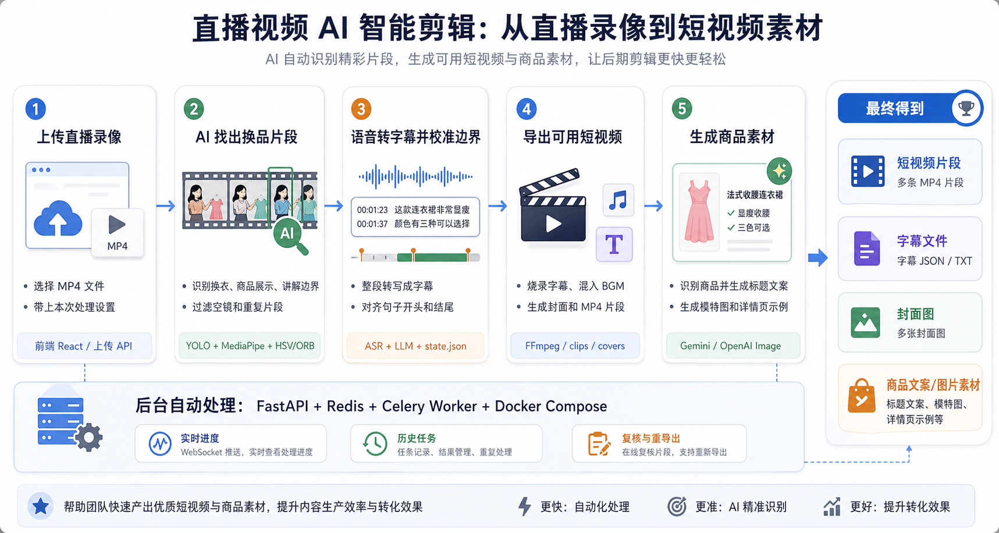
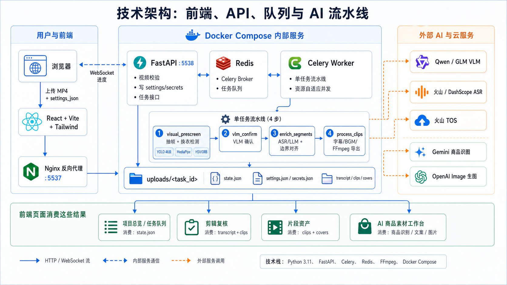

# 直播视频 AI 智能剪辑

一键将直播录像自动拆分为商品讲解短视频片段，支持烧录字幕、karaoke 逐字高亮、语气词/敏感词过滤、字幕位置拖拽调整、智能封面选择、BGM 自动选曲和视频变速。上传 MP4，AI 自动识别换衣节点、转写语音、匹配商品名、导出短视频。



## 快速开始

### 前置条件

- Docker + Docker Compose
- 16GB 内存 + 8 核 CPU（Worker 限制 4GB，无需 GPU）

### 部署

```bash
git clone <repo-url> && cd 直播视频剪辑_GLM
cp .env.example .env
# 编辑 .env，填入 API Key
docker compose up -d
```

- 前端：http://127.0.0.1:5537
- 后端 API 文档：http://127.0.0.1:5538/docs

### 获取 API Key

| 服务 | 用途 | 获取地址 |
|------|------|----------|
| 阿里云 DashScope | VLM (Qwen) / ASR | [DashScope 控制台](https://dashscope.console.aliyun.com/) |
| 智谱开放平台 | VLM (GLM) | [智谱开放平台](https://open.bigmodel.cn/) |
| 火山引擎 | ASR (BigModel / VC) | [火山引擎控制台](https://console.volcengine.com/) |

## 功能特点

- **换衣检测** — 五信号联合（YOLO 46类 + MediaPipe + HSV × 3 + ORB 纹理），支持多信号独立 EMA 或加权投票融合
- **多 ASR 支持** — 火山 VC 字幕（推荐）、火山 BigModel、阿里 DashScope
- **VLM 二次确认** — 支持 Qwen / GLM，按导出模式决定是否参与
- **LLM 文本分析** — 用 LLM 识别换品边界，与视觉检测信号两层树融合
- **字幕烧录** — 四种模式：off / basic / styled / karaoke（逐字高亮 + 弹跳动画），支持预设按钮、拖拽坐标和字号调整
- **设置分块** — AI、转写、字幕、敏感词、切分、导出和高级参数按业务拆分，关键枚举值前端中文展示，减少长表单挤压
- **智能封面** — 商品优先 / 主播优先双策略，COCO YOLO 遮挡检测
- **BGM 自动选曲** — 双库架构（内置 + 用户上传），按商品类型自动匹配
- **语气词过滤** — 三级词表（38词），可仅过滤字幕或同时裁剪视频段
- **敏感词过滤** — 用户自定义词库，命中字幕句可裁掉视频段或跳过整个 clip
- **视频变速** — 0.5x ~ 3x，先烧字幕再变速
- **实时进度** — WebSocket 推送，前端实时展示处理阶段

## 项目结构

```
直播视频剪辑_GLM/
├── backend/                  # FastAPI 后端
│   ├── app/api/              # REST API 端点（上传、任务、片段、音乐库）
│   ├── app/services/         # 核心业务（换衣检测、ASR、VLM、FFmpeg、字幕、BGM）
│   ├── app/tasks/            # Celery 流水线编排 & 四阶段模块
│   ├── assets/               # ML 模型、字体、BGM 曲库、水印
│   └── tests/                # 测试文件
├── frontend/                 # React + TypeScript + Vite
│   └── src/
│       ├── components/       # UI 组件 & 9 个页面
│       ├── hooks/            # WebSocket、TanStack Query hooks
│       └── stores/           # Zustand 状态管理
├── docs/images/              # 架构图 & 流程图
├── docker-compose.yml        # 容器编排（4 services）
└── .env.example              # 环境变量模板
```

<details>
<summary>📁 查看完整目录结构</summary>

```
直播视频剪辑_GLM/
├── docker-compose.yml                                # 容器编排（4 services）
├── .env.example                                     # 环境变量模板
├── CLAUDE.md                                        # 项目真实状态文档
├── AGENTS.md                                        # AI 协作规范
├── docs/
│   └── images/
│       ├── product-flow.png                         # 产品流程图
│       └── technical-architecture.png               # 技术架构图
├── backend/
│   ├── Dockerfile                                   # Python 3.11 + FFmpeg 多阶段构建
│   ├── requirements.txt                             # Python 依赖
│   ├── assets/
│   │   ├── fonts/                                   # 字幕字体
│   │   ├── models/
│   │   │   ├── selfie_multiclass_256x256.tflite     # MediaPipe 6类像素分割
│   │   │   ├── yolov8n-fashionpedia.onnx            # YOLO 46类服装检测
│   │   │   └── yolov8n.onnx                         # COCO YOLO 80类（封面遮挡检测）
│   │   ├── bgm/
│   │   │   ├── bgm_library.json                     # 音乐库索引（mood/category 映射）
│   │   │   └── *.mp3                                # 内置背景音乐
│   │   ├── default_bgm.mp3                          # 默认 BGM fallback
│   │   └── watermark.png                            # 水印图片
│   ├── app/
│   │   ├── main.py                                  # FastAPI 入口，注册路由和异常处理
│   │   ├── config.py                                # 共享配置常量（上传目录、Provider 枚举等）
│   │   ├── api/
│   │   │   ├── health.py                            # 健康检查端点
│   │   │   ├── upload.py                            # 视频上传（流式写入 + 校验）
│   │   │   ├── tasks.py                             # 任务路由（CRUD + WebSocket + 诊断 + 审核 + 重试）
│   │   │   ├── task_helpers.py                      # 任务摘要 / 诊断 / 复核 payload 组装工具
│   │   │   ├── clips.py                             # 片段列表 / 下载 / 批量下载 / 缩略图
│   │   │   ├── settings.py                          # 设置模型与校验 + 敏感字段分离
│   │   │   ├── music.py                             # 音乐库上传 / 标签编辑 / 删除
│   │   │   ├── assets.py                            # 跨任务片段资产浏览与筛选
│   │   │   ├── commerce.py                          # AI 商品素材（识图 / 文案 / 生图 / 批量）
│   │   │   ├── system.py                            # 系统资源监控（cgroup + Redis ping）
│   │   │   ├── error_handler.py                     # 全局异常处理（ASR / 通用 HTTP 错误）
│   │   │   └── validation.py                        # UUID / 安全路径正则校验
│   │   ├── services/
│   │   │   ├── clothing_change_detector.py          # 换衣检测（五信号联合 + 多信号独立 EMA）
│   │   │   ├── clothing_segmenter.py                # MediaPipe 像素分割 + YOLO 品类检测
│   │   │   ├── frame_extractor.py                   # FFmpeg 抽帧（候选场景区域内）
│   │   │   ├── scene_detector.py                    # PySceneDetect 场景分割
│   │   │   ├── vlm_confirmor.py                     # VLM 二次确认（Qwen / GLM）
│   │   │   ├── vlm_client.py                        # Provider 感知的 VLM API 客户端
│   │   │   ├── vlm_parser.py                        # VLM 响应解析（多层 JSON 提取 + 容错）
│   │   │   ├── dashscope_asr_client.py              # DashScope paraformer-v2 ASR
│   │   │   ├── volcengine_asr_client.py             # 火山 BigModel ASR（标准版 + 极速版）
│   │   │   ├── volcengine_vc_client.py              # 火山 VC 字幕 ASR（剪映引擎分句）
│   │   │   ├── asr_errors.py                        # ASR 异常层级（Auth / Timeout / API / NoSpeech）
│   │   │   ├── transcript_merger.py                 # 分段 ASR 结果合并 + 偏移校正
│   │   │   ├── srt_generator.py                     # SRT / ASS 字幕生成（含 karaoke 逐字高亮）
│   │   │   ├── ffmpeg_builder.py                    # FFmpeg 命令构建（裁切 / 烧录 / 变速 / BGM）
│   │   │   ├── filler_filter.py                     # 语气词过滤（三级词表 + 视频裁剪）
│   │   │   ├── sensitive_filter.py                  # 敏感词过滤（用户自定义词库）
│   │   │   ├── subtitle_overrides.py                # 字幕覆盖校验（行数 / 长度 / ASS 注入过滤）
│   │   │   ├── cover_selector.py                    # 智能封面（双策略评分 + 遮挡检测）
│   │   │   ├── bgm_selector.py                      # BGM 自动选曲（双库 + 商品类型匹配）
│   │   │   ├── product_matcher.py                   # 商品名匹配（VLM > ASR > 描述 fallback）
│   │   │   ├── segment_validator.py                 # 分段合法性校验（时长 + 去重）
│   │   │   ├── text_segment_analyzer.py             # LLM 文本边界分析
│   │   │   ├── segment_fusion.py                    # 两层树信号融合（Outfit + Product）
│   │   │   ├── boundary_snapper.py                  # 句边界对齐（ASR 句子边界 snap）
│   │   │   ├── boundary_refiner.py                  # LLM 边界精修（开头完整性 + 结尾自然）
│   │   │   ├── resource_detector.py                 # cgroup v2 容器资源检测（CPU / 内存）
│   │   │   ├── gemini_vision_client.py              # Gemini 封面识图 + 平台文案生成
│   │   │   ├── openai_image_client.py               # OpenAI Image 模特图 / 详情图生成
│   │   │   ├── list_index.py                        # SQLite 列表索引缓存（WAL + 自动重建）
│   │   │   ├── memory_cache.py                      # API 进程内 mtime 指纹缓存
│   │   │   ├── state_machine.py                     # 任务状态机（状态转换规则）
│   │   │   ├── cleanup.py                           # 临时文件 / 抽帧目录清理
│   │   │   └── validator.py                         # 视频文件校验（ffprobe 格式/编码/音频流）
│   │   ├── utils/
│   │   │   └── json_io.py                           # 统一 JSON 读写（原子写入 + 临时文件）
│   │   └── tasks/
│   │       ├── pipeline.py                          # 薄编排器（~310 行）+ Celery task 定义
│   │       ├── shared.py                            # 跨 stage 共享工具（路径 / JSON / 日志）
│   │       └── stages/
│   │           ├── visual_prescreen.py              # Stage 1: 抽帧 + 换衣检测
│   │           ├── vlm_confirm.py                   # Stage 2: VLM 二次确认
│   │           ├── enrich_segments.py               # Stage 3: ASR + LLM + 融合 + 边界对齐
│   │           └── process_clips.py                 # Stage 4: 字幕 + FFmpeg + BGM + 封面
│   └── tests/                                       # 测试文件
└── frontend/
    ├── Dockerfile                                   # Node 20 构建 + Nginx 运行
    ├── nginx.conf                                   # Nginx（20G 上传 + WebSocket 代理）
    ├── package.json
    └── src/
        ├── main.tsx                                 # React 入口
        ├── App.tsx                                  # 根组件
        ├── router.tsx                               # react-router-dom 路由配置
        ├── components/
        │   ├── AdminDashboard.tsx                   # 主应用壳（左侧导航 + 右侧内容区）
        │   ├── UploadZone.tsx                       # 拖拽上传区域
        │   ├── ProgressBar.tsx                      # 管线进度条（8 阶段）
        │   ├── ResultGrid.tsx                       # 片段结果网格
        │   ├── VideoPreview.tsx                     # 视频预览弹窗
        │   ├── ErrorCard.tsx                        # 错误卡片
        │   ├── ConfirmDialog.tsx                    # 通用确认弹窗
        │   ├── ToastViewport.tsx                    # Toast 通知容器
        │   ├── ui/
        │   │   └── dialog.tsx                       # 自定义 Dialog 组件
        │   └── admin/
        │       ├── api.ts                           # API 调用封装（fetchJson / fetchText）
        │       ├── types.ts                         # 全局类型定义
        │       ├── context.ts                       # Admin 上下文（项目切换 / 共享状态）
        │       ├── format.ts                        # 格式化工具（状态分类 / 时长 / 日期）
        │       ├── constants.tsx                    # 常量（状态映射 / 图标 / 枚举中文标签）
        │       ├── shared.tsx                       # 共享 UI 组件（DrawerShell / FilterToolbar / Card）
        │       ├── settings/
        │       │   ├── labels.ts                       # 设置项中文标签映射
        │       │   ├── SettingsControls.tsx             # 通用表单控件（Select / Slider / Switch）
        │       │   ├── SettingsSections.tsx             # 设置分块渲染（AI / 转写 / 字幕 / 导出等）
        │       │   └── types.ts                         # 设置页内部类型定义
        │       └── pages/
        │           ├── ProjectManagementPage.tsx    # 项目总览（任务列表 + 右侧详情抽屉）
        │           ├── CreateProjectPage.tsx        # 新建项目 + 上传
        │           ├── QueuePage.tsx                # 任务队列（流式列表 + 进度 + 日志）
        │           ├── ReviewPage.tsx               # 剪辑复核（卡片 + 字幕编辑 + 重导出）
        │           ├── AssetsPage.tsx               # 片段资产（按项目分组 + AI 素材状态）
        │           ├── CommerceWorkbenchPage.tsx    # AI 商品素材工作台（识图 / 文案 / 生图）
        │           ├── MusicPage.tsx                # 音乐库管理（上传 / 播放 / 标签编辑）
        │           ├── DiagnosticsPage.tsx          # 任务诊断（指标卡 + 漏斗图 + 事件日志）
        │           └── SettingsPage.tsx             # 设置页容器（状态 / 保存 / 页签）
        ├── hooks/
        │   ├── useAdminQueries.ts                   # TanStack Query hooks（15+ 查询）
        │   ├── useWebSocket.ts                      # WebSocket 实时进度推送
        │   └── useDebouncedValue.ts                 # 搜索输入防抖 hook
        ├── stores/
        │   ├── settingsStore.ts                     # 设置状态（44 字段 + localStorage 持久化）
        │   ├── taskStore.ts                         # 任务列表状态
        │   ├── toastStore.ts                        # Toast 通知状态
        │   └── confirmStore.ts                      # 确认弹窗状态
        └── lib/
            └── utils.ts                             # cn() Tailwind 类名合并工具
```

</details>

## 系统架构



## 技术栈

| 层级 | 技术 |
|------|------|
| 前端 | React 19 + TypeScript + Vite + Tailwind CSS + Zustand + TanStack Query |
| 后端 | FastAPI + Celery + Redis |
| 检测 | YOLOv8 (ONNX) + MediaPipe (TFLite) + HSV + ORB |
| VLM | Qwen / GLM (OpenAI 兼容 API) |
| ASR | 火山 VC / 火山大模型 / 阿里 DashScope |
| 视频处理 | FFmpeg |
| 部署 | Docker Compose (4 services) |

## 配置说明

编辑 `.env` 文件，关键配置：

| 变量 | 说明 | 默认值 |
|------|------|--------|
| `VLM_API_KEY` | VLM API Key | 空 |
| `VOLCENGINE_ASR_API_KEY` | 火山引擎 ASR API Key | 空 |
| `TOS_AK` / `TOS_SK` | 火山 TOS 凭据 | 空 |
| `LLM_API_KEY` | LLM API Key | 空 |
| `DOCKER_REGISTRY` | Docker 镜像加速（国内可选） | 空 |

ASR 的 Provider 选择和 API Key 在前端设置页面配置。完整配置参考 [.env.example](.env.example)。

## 服务说明

| 服务 | 端口 | 说明 | 内存 |
|------|------|------|------|
| frontend | 5537 | React SPA + Nginx | 默认 |
| api | 5538 | FastAPI + Uvicorn | 2G |
| worker | — | Celery 异步任务 | 4G |
| redis | 6379 | 消息队列 | 默认 |

## 常见问题

**ASR 怎么选？** karaoke 字幕必须选 `volcengine_vc`；basic 字幕 `dashscope` 最便宜。

**上传大文件失败？** nginx 已默认配置 `client_max_body_size 20G`，如用反向代理需同步调整。

**查看日志：**

```bash
docker compose logs -f worker   # 任务处理日志
docker compose logs -f api      # API 日志
```

## License

MIT
