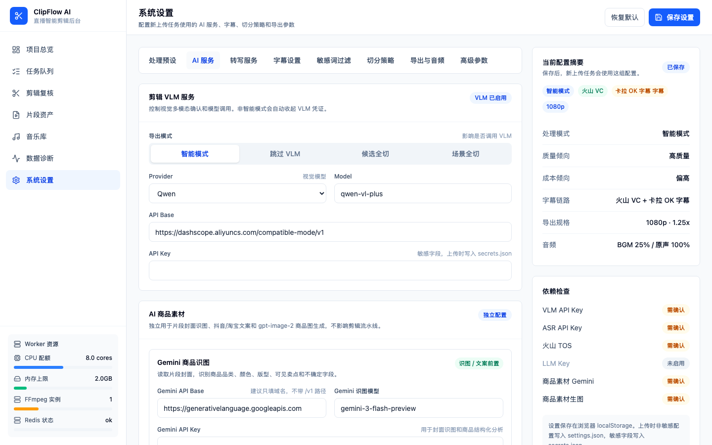

# AI 商品素材工作台

AI 商品素材工作台可以从片段封面图自动生成商品营销素材，包括商品分析、平台文案和模特展示图。

## 入口

在「片段资产」页面，每个片段卡片上有「AI素材」按钮。点击后会在新标签页打开独立工作台。

> 你也可以在资产页勾选多个片段，通过底部的「批量 AI 素材」按钮一次提交。

## 三步工作流

工作台将素材生成分为三个步骤，每步独立运行，可以单独重试。

### 第一步：商品分析

使用 Gemini 识别片段封面图中的商品信息：

- 商品类目（如连衣裙、毛衣、半裙）
- 颜色和色系
- 版型（修身、宽松、直筒等）
- 袖型（长袖、短袖、无袖等）
- 面料质感描述

点击「开始分析」按钮启动。分析完成后结果会显示在页面上。

### 第二步：生成文案

基于商品分析结果，为两个平台生成营销文案：

**抖音文案**
- 短标题（15 字以内）
- 视频描述（50-100 字）
- 推荐话题标签（3-5 个）

**淘宝文案**
- 商品卖点（3-5 条，每条一句话）
- 适合场景描述

点击「生成文案」按钮启动。

### 第三步：生成图片

使用 OpenAI 的图片生成模型，根据封面图和商品信息生成四张营销图片：

| 图片类型 | 说明 |
|----------|------|
| 正面模特图 | 商品正面展示 |
| 侧面模特图 | 侧面角度展示 |
| 背面/细节图 | 背面或细节特写 |
| 淘宝详情页示例 | 适合详情页使用的展示图 |

默认生成 2K 分辨率（2048×2048）。每张图片可以单独点击「重试」重新生成。

## 批量提交

在片段资产页面：

1. 勾选需要生成素材的片段
2. 点击底部操作栏的「批量 AI 素材」
3. 选择要执行的步骤（分析 / 文案 / 图片）
4. 提交后右侧会弹出队列抽屉，显示每个片段的处理状态

> 批量提交不会阻塞页面，你可以在处理过程中继续其他操作。

## API 配置

AI 商品素材使用独立的 API 配置，与视频剪辑的 VLM 设置分开。

配置路径：**设置 → AI 服务 → AI 商品素材**

需要填写两组密钥：

| 配置项 | 用途 | 默认值 |
|--------|------|--------|
| Gemini API 密钥 | 商品识别和文案生成 | 无 |
| Gemini 模型 | 商品分析模型 | gemini-3-flash-preview |
| OpenAI API 密钥 | 图片生成 | 无 |
| OpenAI 模型 | 图片生成模型 | gpt-image-2 |
| 图片尺寸 | 输出分辨率 | 2K（2048×2048） |

> API 密钥属于敏感信息，保存时会加密存储，不会在页面中回显。
