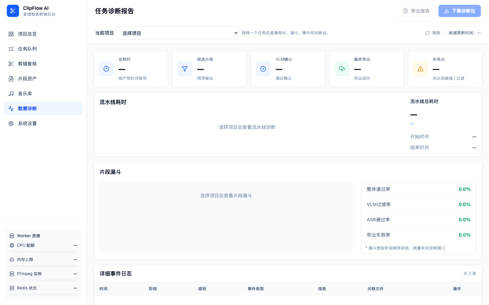

# 任务诊断

当任务处理失败、切出来的片段太少，或者结果跟预期不一样时，诊断页面能帮你搞清楚问题出在哪。

---

## 进入诊断页面

1. 点击左侧导航栏的 **任务诊断**
2. 页面顶部有一个项目下拉框，选择你要排查的任务
3. 选中后，页面会自动加载该任务的诊断数据

> 只有状态为"处理中"、"已完成"或"失败"的任务才有诊断数据。刚上传还没开始处理的任务不会显示诊断信息。



---

## 指标卡说明

页面顶部有一排指标卡，快速告诉你这个任务的整体情况：

| 指标 | 含义 |
|------|------|
| **总耗时** | 这个任务从开始到结束花了多长时间。20 分钟视频的正常范围是 8 到 15 分钟 |
| **候选片段** | 换衣检测阶段找出了多少个"可能值得切出来"的片段。数量取决于主播换了几次衣服 |
| **AI 确认** | 经过 VLM 二次确认后，有多少个片段被 AI 认可。这个数字通常比候选片段少 |
| **最终导出** | 最终实际导出了多少个成品片段。比 AI 确认数少是正常的（空镜过滤、敏感词过滤会排除一些） |
| **未导出** | 被过滤掉没有导出的片段数量。点击数字可以在事件日志里查看具体原因 |

如果"候选片段"很多但"最终导出"很少，说明大量片段在后续阶段被过滤了。可以往下看漏斗图，定位是在哪个环节被筛掉的。

---

## 处理管线

指标卡下方是一张横向时间线图，展示四个阶段的处理耗时：

```
抽帧检测 → AI 确认 → 转写分析 → 导出剪辑
```

每个阶段显示两个信息：

- **耗时**：这个阶段实际花了多少秒
- **占比**：占整个任务处理时间的百分比

通过这张图你能快速判断瓶颈在哪。比如"导出剪辑"占比 50% 以上，说明 FFmpeg 视频处理是主要耗时环节，这是正常的；如果"抽帧检测"占比特别高，可能是视频分辨率太大导致帧分析变慢。

---

## 漏斗图

漏斗图是诊断页面最核心的部分，展示从原始帧到最终片段的层层过滤过程：

```
原始帧（全部抽出来的画面）
  ↓ 换衣检测
候选片段（检测到换衣的时间点）
  ↓ AI 确认（VLM 过滤）
确认片段（AI 认可的片段）
  ↓ 导出过滤（空镜、敏感词等）
最终导出（你拿到的成品片段）
```

每一层变窄的幅度告诉你过滤了多少内容。几个典型情况：

- **候选片段 → 确认片段** 急剧收窄：AI 判定大量候选是误判。如果你觉得切漏了，可以把导出模式改为"跳过 VLM"试试
- **确认片段 → 最终导出** 急剧收窄：空镜过滤或敏感词过滤排除了一些片段。查看事件日志能找到具体原因
- **每层都收窄不多**：说明各阶段都在正常工作，最终产出数量合理

---

## 事件日志

页面下方是事件日志列表，按时间顺序记录了任务处理过程中的每一条信息。

### 日志级别

每条日志前面有一个级别标签，含义如下：

| 级别 | 含义 | 你需要做什么 |
|------|------|-------------|
| **OK** | 正常完成 | 不用管，只是告诉你这一步顺利通过了 |
| **Info** | 一般信息 | 了解一下就行，比如"检测到 15 个候选片段" |
| **Warning** | 警告 | 不影响处理，但可能影响结果质量。比如"某帧分析失败，已跳过" |
| **Error** | 错误 | 这个阶段出了问题。如果任务最终失败，重点看 Error 级别的日志 |

### 日志里有什么

每条日志包含这些信息：

- **时间戳**：这条事件发生的精确时间
- **阶段**：发生在哪个处理阶段（抽帧检测 / AI 确认 / 转写分析 / 导出剪辑）
- **级别**：OK / Info / Warning / Error
- **消息**：具体发生了什么的描述
- **来源文件**：后端代码的哪个文件产生了这条日志（高级用户排查用）

点击任意一条日志，右侧会展开详情，显示完整的消息内容和处理建议。

> 事件日志使用分页展示，底部有翻页控件。如果日志很多，可以用阶段和级别进行筛选。

---

## 异常建议

当系统检测到任务处理中有异常时，会在页面右侧自动生成"异常建议"卡片。

每条建议包含三部分：

1. **问题描述**：用通俗的话告诉你出了什么问题
2. **可能原因**：为什么会发生这种情况
3. **建议操作**：你可以做什么来修复或避免

常见建议示例：

- "VLM API 调用超时" → 建议检查 API Key 是否正确，网络是否通畅
- "候选片段数量为 0" → 建议检查视频画面中是否有清晰的人物和服装变化
- "ASR 转写失败" → 建议检查视频是否有声音，ASR API Key 是否有效

---

## 导出工具

诊断页面提供两个导出按钮，位于页面右上角：

### 导出诊断报告

点击后下载一份 JSON 格式的诊断报告，包含：

- 任务基本信息（视频名称、时长、创建时间）
- 四个阶段的耗时统计
- 漏斗数据（各阶段的片段数量）
- 所有事件日志

这份报告适合发给技术人员帮你排查问题。

### 下载调试包

点击后下载一个 ZIP 压缩包，里面包含这个任务的所有调试文件：

- 诊断报告（JSON）
- 候选片段数据
- ASR 转写结果
- 换衣检测详细数据
- 任务配置信息

调试包是排查复杂问题的完整资料，发给技术支持时请优先提供这个文件。

---

## 什么时候该用诊断页面

| 情况 | 你应该看什么 |
|------|-------------|
| 任务显示"失败" | 查看事件日志中的 Error 级别记录，看异常建议 |
| 切出来的片段太少 | 看漏斗图，确认是检测阶段就少了，还是被后续过滤掉了 |
| 切出来的片段太多 | 看候选片段数量，考虑开启 VLM 确认或提高检测阈值 |
| 某个阶段耗时特别长 | 看处理管线的时间线，确认瓶颈环节 |
| 字幕效果不好 | 查看事件日志中转写分析阶段的 Warning |
| 想让技术人员帮忙排查 | 点击"下载调试包"，把 ZIP 文件发过去 |

> 多数情况下，先看异常建议和漏斗图就能定位问题。如果需要更深入的分析，再看事件日志的详细记录。

---

## 下一步

- [上传视频](uploading-videos.md) — 重新上传视频，调整预设参数
- [设置详解](settings-explained.md) — 调整检测灵敏度和过滤规则
- [常见问题](../faq.md) — 查看其他用户遇到过的类似问题
