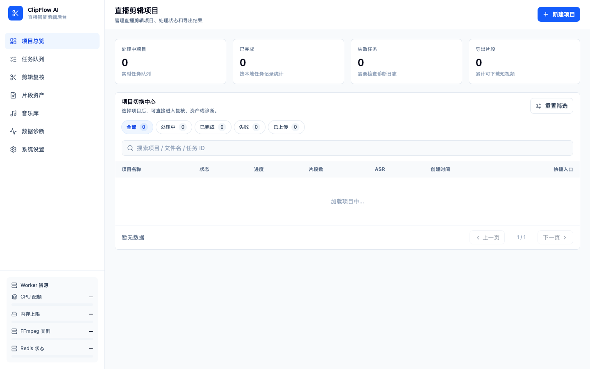
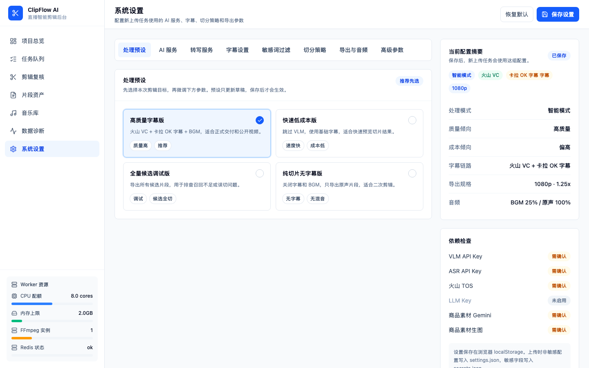
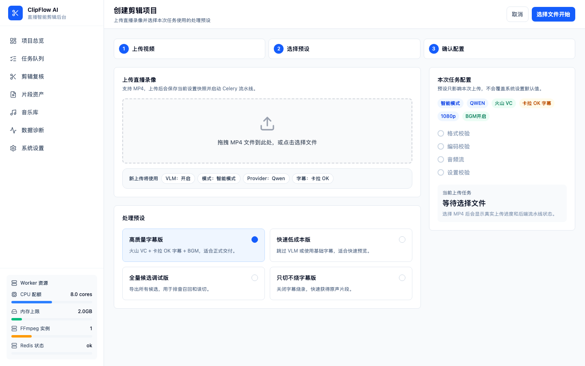
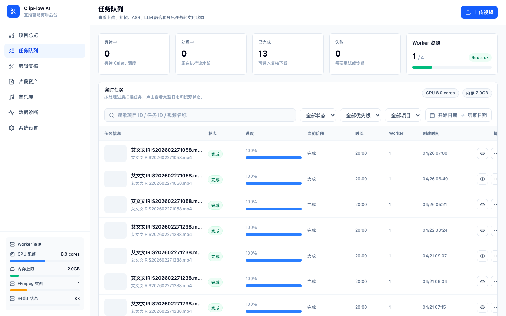
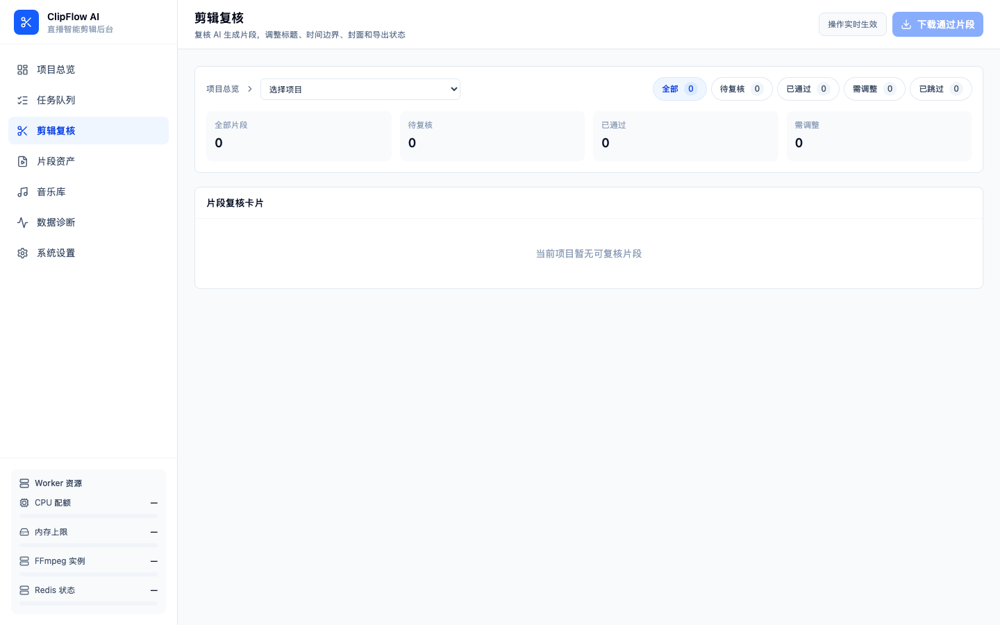
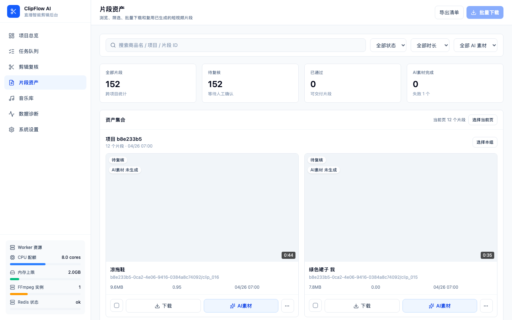

# 快速开始

5 分钟，从零到拿到你的第一条 AI 自动剪辑片段。

---

## 你将完成什么

把一段直播录像扔进去，AI 帮你自动切成一个个商品讲解的短视频片段，带字幕、带封面，直接拿去发短视频平台。

**不需要你会剪辑，不需要你懂技术。** 会拖拽文件就行。

---

## 准备工作

开始之前，确认这几样东西准备好了：

| 准备项 | 说明 |
|--------|------|
| 应用已启动 | Docker 已运行，浏览器能打开系统页面 |
| 一段直播录像 | MP4 格式，建议 10 到 30 分钟的直播回放 |
| 火山引擎 API Key | 用于语音转文字（转写服务），在火山引擎控制台申请 |
| （可选）AI 识别 Key | 用于智能判断每段讲的是什么商品。如果用"快速低成本版"预设，可以不填 |

> 💡 没有火山引擎账号？去 [火山引擎官网](https://www.volcengine.com/) 注册，开通"大模型 ASR"服务即可，新用户有免费额度。

---

## 第一步：打开应用

在浏览器地址栏输入：

```
http://127.0.0.1:5537
```

你会看到左侧有一排导航菜单，一共 8 项：

| 菜单项 | 干什么用的 |
|--------|-----------|
| 项目总览 | 查看所有历史任务 |
| 创建任务 | 上传新视频，从这里开始 |
| 任务队列 | 看处理进度 |
| 片段审核 | 看剪辑结果，修改字幕 |
| 素材资产 | 浏览和批量下载成品片段 |
| 音乐库 | 管理背景音乐 |
| 任务诊断 | 排查处理问题（一般用不到） |
| 设置 | 配置 API Key 和各种参数 |



---

## 第二步：配置 API Key

点左侧菜单的 **设置**，进入设置页面。



需要填写两个地方：

### 2.1 转写服务（必填）

1. 点击顶部页签 **转写服务**
2. "转写引擎"选择 **火山引擎 VC 字幕**（效果最好）
3. 填入你的 **ASR API Key**

### 2.2 AI 服务（按需填写）

1. 点击顶部页签 **AI 服务**
2. 如果你想让 AI 自动识别每段讲解的商品名称，填入 VLM 对应的 API Key
3. 如果你只是先试试效果，可以先不填，后面上传时选"快速低成本版"预设就行

填完记得点页面底部的 **保存设置**。

---

## 第三步：上传第一个视频

点左侧菜单的 **创建任务**。



操作很简单：

1. **选择预设**：页面会展示 4 种预设，推荐新手选 **高质量字幕版**

   | 预设名称 | 适合场景 | 说明 |
   |---------|---------|------|
   | 高质量字幕版 ✨ | 日常使用 | AI 识别商品 + 卡拉OK字幕 + 背景音乐，效果最完整 |
   | 快速低成本版 | 赶时间、省钱 | 不用 AI 识别，基础字幕，速度快 |
   | 全量候选调试版 | 调试用 | 输出所有候选片段，方便排查问题 |
   | 纯切片无字幕版 | 只要切片 | 只切片段，不烧字幕 |

2. **拖入视频**：把准备好的 MP4 文件拖到上传区域
3. **点上传**：等进度条走完

上传完成后，系统会自动开始处理，不需要额外操作。

---

## 第四步：等待处理完成

上传后点左侧菜单的 **任务队列**，能看到当前任务的处理进度。



处理分为 4 个阶段：

| 阶段 | 在干什么 | 大概耗时 |
|------|---------|---------|
| 抽帧检测 | 逐帧分析画面，找出主播换衣服的时间点 | 3 到 5 分钟 |
| AI 确认 | AI 判断每个片段是否真的在讲商品 | 1 到 2 分钟 |
| 转写分析 | 把语音转成文字，匹配到对应片段 | 1 到 2 分钟 |
| 导出剪辑 | 切片、烧字幕、加背景音乐、生成封面 | 3 到 5 分钟 |

> ⏱️ 一段 20 分钟的直播视频，在 MacBook Air M4 上大概需要 **10 分钟**处理完成。时间长短取决于视频时长和你选的预设。

处理过程中你可以离开页面，回来后队列会自动刷新状态。状态显示"已完成"就可以去拿结果了。

---

## 第五步：查看和下载结果

处理完成后有两种方式查看结果：

### 片段审核

点左侧菜单 **片段审核**，可以逐条查看每个剪辑片段：

- 播放视频预览
- 查看和修改字幕文本
- 标记"通过"或"跳过"
- 对不满意的片段重新导出



### 素材资产

点左侧菜单 **素材资产**，按项目分组浏览所有成品片段：

- 查看封面缩略图和时长
- 单独下载某个片段
- 批量选择后一键打包下载（最多 20 个一批）



> 🎉 到这里，你已经拿到了 AI 自动剪辑的短视频片段，可以直接发到抖音、快手、小红书等平台了。

---

## 推荐配置

如果你不确定怎么选，照这个配就行：

| 设置项 | 推荐值 | 为什么 |
|--------|-------|--------|
| 转写引擎 | 火山引擎 VC 字幕 | 分句最智能，卡拉OK字幕效果最好 |
| 字幕模式 | 卡拉OK（karaoke） | 逐字高亮，像 KTV 一样，观众看着不累 |
| 导出模式 | 智能模式（smart） | AI 自动筛选，只留真正在讲商品的片段 |
| 背景音乐 | 开启 | 自动选曲，片段不干巴 |

这套组合经过反复测试，效果和速度的平衡点最好。

---

## 下一步

学会了基本流程，可以继续了解这些：

- [上传视频的更多选项](uploading-videos.md) — 预设参数详解，高级上传技巧
- [片段审核指南](reviewing-clips.md) — 字幕修改、重新导出、批量操作
- [设置详解](settings-explained.md) — 每个设置项的含义和推荐值

有问题？先看看 [任务诊断](../user-guide/diagnostics-guide.md) 页面能不能帮你定位问题。
