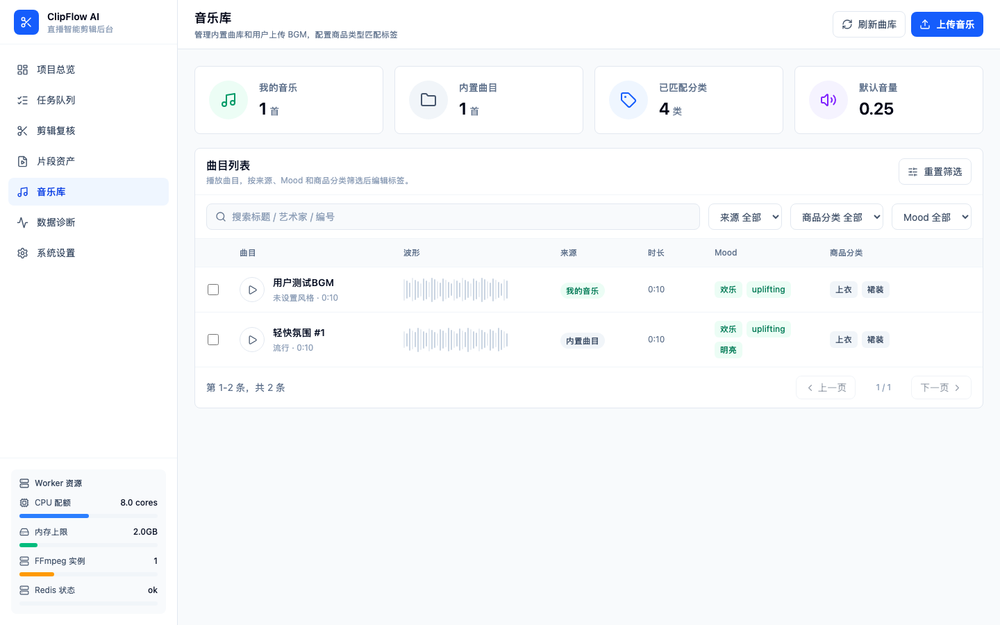

# 音乐库管理

音乐库为导出的短视频片段提供背景音乐（BGM）。系统会根据商品类型自动匹配最合适的曲目。

## 曲目来源

音乐库包含两个来源：

| 来源 | 说明 | 可否编辑 | 可否删除 |
|------|------|----------|----------|
| 内置曲目 | 系统预置的背景音乐 | ❌ 只能试听 | ❌ |
| 我的音乐 | 你上传的曲目 | ✅ 可编辑标签 | ✅ 可删除 |

上传的曲目在自动选曲时优先于内置曲目。

## 上传曲目

1. 将 MP3 文件拖拽到页面顶部的上传区域
2. 系统自动校验文件格式和大小（上限 20MB）
3. 上传完成后自动弹出标签编辑窗口

## 编辑标签

上传后建议完善曲目标签，帮助系统更精准地匹配商品类型。

可编辑的标签字段：

- **标题**：曲目的显示名称
- **风格**（Mood）：选择最能描述这首曲子的氛围
- **商品分类**：这首曲子适合搭配的商品类型
- **节奏**：快 / 中 / 慢
- **能量**：高 / 中 / 低
- **类型**：音乐风格分类

### 风格选项（12 种）

明亮、休闲、温暖、奢华、活力、柔和、清新、优雅、治愈、浪漫、轻松、欢快

### 商品分类选项（10 种）

连衣裙、外套、裤装、半裙、鞋靴、包袋、配饰、美妆、家居、上装

## 播放器

页面底部有全宽播放器栏，支持：

- 播放 / 暂停
- 上一首 / 下一首
- 进度条拖拽
- 显示当前曲目名称和播放时间

点击曲目列表中的任意曲目即可开始播放。

## 管理操作

在曲目列表中，用户上传的曲目可以：

- **编辑标签**：点击编辑图标，弹出标签编辑抽屉
- **删除**：点击删除图标，确认后删除曲目文件和标签

内置曲目只能试听，编辑和删除按钮不可用。

## 自动选曲机制

导出短视频时，系统会根据每个片段的商品类型自动匹配背景音乐：

1. 从商品名称或类目推断商品类型（如「雪纺连衣裙」→ 连衣裙）
2. 在音乐库中筛选匹配该商品分类的曲目
3. 优先选择你上传的曲目
4. 跨片段去重，避免多个片段使用同一首音乐
5. 没有匹配时从全部曲库中随机选择

如果你没有上传任何曲目，系统会使用内置曲库。

> 想让选曲更精准？多上传一些曲目并填好风格和商品分类标签。
