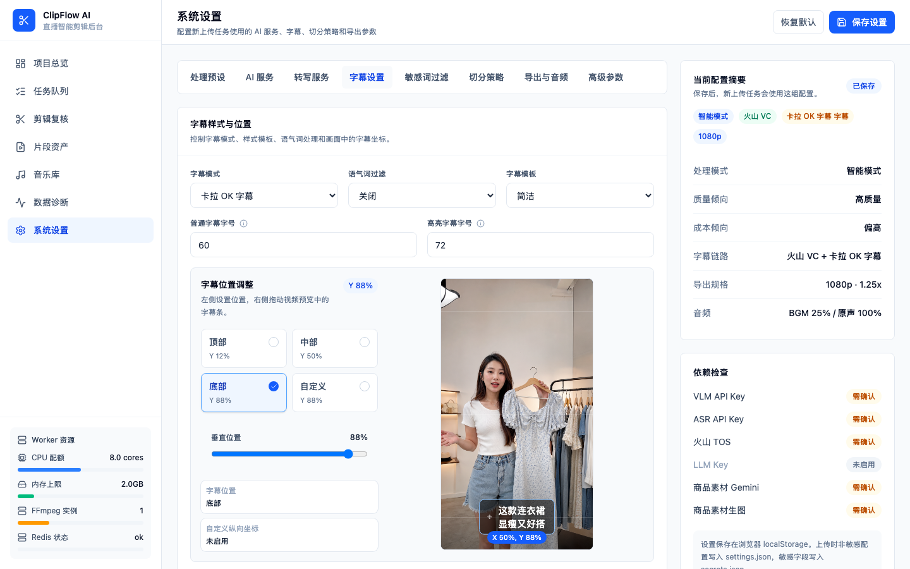
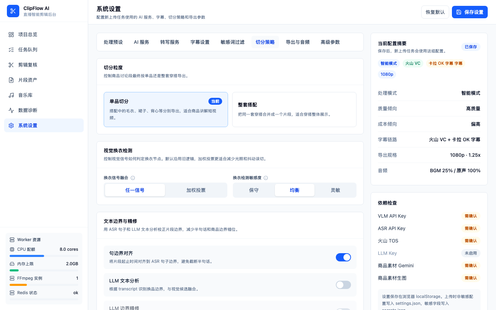
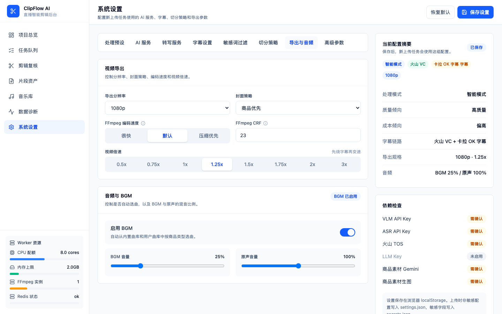

# 设置详解

打开左侧导航栏的"设置"页面，你会看到顶部分成了 8 个页签。每个页签管一类配置，互不干扰。

> **重要**：所有设置保存在你的浏览器里，只影响**之后新上传**的视频。已经在上传或处理中的任务不受影响。

---

## 一、处理预设

这个页签管理上传时的预设方案，也就是你在上传页面选择的"高质量字幕版""快速低成本版"等。预设的具体含义请参考 [上传视频](uploading-videos.md)。

| 设置名     | 白话解释                                           | 推荐值         | 小贴士                           |
| ---------- | -------------------------------------------------- | -------------- | -------------------------------- |
| 导出模式   | 控制切出来的片段怎么筛选                           | smart（智能）  | 选 smart 就行，其他模式适合调试 |
| VLM 开关   | 是否让 AI 帮你确认每个切分点                       | 开启           | 关掉的话只靠画面变化来切        |
| VLM 服务商 | 用哪个 AI 来确认切分点                             | 按需选择       | 需要填写对应的 API Key          |
| API 地址   | AI 服务的接口地址                                  | 默认值即可     | 一般不用改                       |
| 模型名称   | 使用的 AI 模型                                     | 默认值即可     | 除非你知道自己在干什么           |
| API Key    | AI 服务的密钥                                      | 必填           | 不会明文显示，放心填             |

### 导出模式详解

| 模式         | 效果                                               | 什么时候用         |
| ------------ | -------------------------------------------------- | ------------------ |
| smart        | AI 确认每个切分点，只保留确认换品的片段             | 日常使用，推荐     |
| no_vlm       | 不做 AI 确认，画面检测到变化就切                   | 快速预览           |
| all_candidates | 导出所有候选片段，不管 AI 确认结果               | 调试参数           |
| all_scenes   | 导出所有场景片段                                   | 调试参数           |

---

## 二、AI 服务

这里配置 AI 商品素材功能（生成模特图、商品文案等），和上面的剪辑 AI 是**两套独立的配置**。

| 设置名             | 白话解释                             | 推荐值                              | 小贴士                       |
| ------------------ | ------------------------------------ | ----------------------------------- | ---------------------------- |
| 商品识图 API Key   | Gemini 服务的密钥                    | 必填                                | 用于识别商品和生成文案       |
| 商品识图 API 地址  | Gemini 接口地址                      | 默认 `https://generativelanguage.googleapis.com` | 不用改     |
| 商品识图模型       | Gemini 模型名称                      | gemini-3-flash-preview              |                              |
| 生图 API Key       | OpenAI 图片生成的密钥                | 必填                                | 用于生成模特图和详情页       |
| 生图 API 地址      | OpenAI 接口地址                      | 默认 `https://api.openai.com/v1`    | 不用改                       |
| 生图模型           | 图片生成模型                         | gpt-image-2                         |                              |
| 图片尺寸           | 生成图片的大小                       | 2K（2048x2048）                     | 2K 清晰度够用               |
| 图片质量           | 生成图片的质量                       | 标准                                | 高质量出图慢一点             |

---

## 三、转写服务

语音转文字（ASR）的配置。这部分直接决定字幕质量和费用。

| 设置名       | 白话解释                     | 推荐值          | 小贴士                                   |
| ------------ | ---------------------------- | --------------- | ---------------------------------------- |
| 转写服务     | 用哪家来做语音转文字         | 火山 VC 字幕    | VC 字幕效果最好，卡拉 OK 必须选它        |
| API Key      | 火山引擎的密钥               | 必填            | 和 BigModel ASR 共用同一个 key           |
| TOS AK       | 火山引擎对象存储的访问密钥   | 选火山 VC 时必填 | 上传音频用的存储服务                     |
| TOS SK       | 火山引擎对象存储的密钥       | 选火山 VC 时必填 |                                          |
| TOS 存储桶   | 存储桶名称                   | 选火山 VC 时必填 |                                          |
| TOS 区域     | 存储桶所在区域               | 选火山 VC 时必填 | 和存储桶保持一致                         |
| TOS 接入点   | 存储服务的地址               | 选火山 VC 时必填 |                                          |

### 转写服务对比

| 服务         | 费用        | 字幕效果 | 适合场景               |
| ------------ | ----------- | -------- | ---------------------- |
| 火山 VC 字幕 | 约 6.5 元/小时 | 最好   | 卡拉 OK 字幕，准备发布 |
| 火山 BigModel | 约 2.3~4.5 元/小时 | 还行 | 基础字幕，日常使用    |
| 阿里云       | 约 0.29 元/小时 | 一般   | 快速预览，省成本       |

> **关于卡拉 OK 字幕**：卡拉 OK 的逐字高亮效果依赖精确的逐字时间戳。火山 VC 用的是剪映引擎分句，时间戳和真人说话节奏一致，效果最好。阿里云的时间戳是均匀分配的，用卡拉 OK 模式会出现跳字不同步的问题。

---

## 四、字幕设置

字幕的样式和位置控制。

> 下方截图中的直播预览为 AI 生成的虚构合成素材，用于演示字幕位置，不对应真实人物。

| 设置名             | 白话解释                                     | 推荐值  | 小贴士                                 |
| ------------------ | -------------------------------------------- | ------- | -------------------------------------- |
| 字幕模式           | 字幕的显示方式                               | 卡拉 OK | 短视频推荐卡拉 OK，有逐字高亮效果      |
| 字幕位置           | 字幕显示在画面的什么位置                     | 底部    | 底部最常见，自定义位置可以拖拽调整     |
| 自定义位置（纵）   | 字幕的纵向百分比，仅"自定义"位置时可调整     | 80%     | 右侧有预览，拖拽即可                   |
| 字幕字号           | 普通字幕的大小                               | 60      | 数字越大字越大                          |
| 高亮字幕字号       | 卡拉 OK 模式下，当前高亮字的大小             | 72      | 比普通字幕大一号，突出效果             |

### 字幕模式详解

| 模式    | 效果                         | 适合场景           |
| ------- | ---------------------------- | ------------------ |
| 关闭    | 不加字幕                     | 只需要切片         |
| 基础    | 普通白色字幕，一句一显示     | 快速预览           |
| 样式    | 带样式的字幕                 | 有一定美化需求     |
| 卡拉 OK | 逐字高亮，当前字有弹跳动画   | 短视频发布，效果最好 |

### 字幕位置说明

- **顶部**：字幕在画面上方
- **中部**：字幕在画面中间
- **底部**：字幕在画面下方（默认，最常用）
- **自定义**：通过右侧的 9:16 预览图拖拽调整位置

---

## 五、敏感词过滤

如果直播中有些不该说出口的内容，可以在这里设置自动过滤。

| 设置名         | 白话解释                                   | 推荐值       | 小贴士                           |
| -------------- | ------------------------------------------ | ------------ | -------------------------------- |
| 开关           | 是否开启敏感词过滤                         | 按需         | 默认关闭                         |
| 敏感词库       | 你自己维护的敏感词列表                     | 最多 200 个  | 一行一个词                       |
| 过滤方式       | 命中后怎么处理                             | 裁掉对应片段 | "跳过整个片段"更严格             |
| 匹配方式       | 怎么判断命中                               | 包含匹配     | 精确匹配只判断整句完全等于敏感词 |

### 过滤方式说明

- **裁掉对应片段**：只把命中字幕句的那几秒视频裁掉，其余部分保留。类似于把一句话静音+剪掉。
- **跳过整个片段**：只要某个片段里有一句命中，整个片段都不要了。

---

## 六、切分策略

控制视频怎么切成一段一段的。

| 设置名         | 白话解释                                   | 推荐值       | 小贴士                           |
| -------------- | ------------------------------------------ | ------------ | -------------------------------- |
| 切分粒度       | 按单品切还是按整套搭配切                   | 单品         | 见下方详解                       |
| 场景阈值       | 画面变化多大算换了一个场景                 | 默认值       | 值越小越灵敏，切出来的片段越多   |
| 去重           | 相似的片段要不要合并                       | 开启         | 避免重复片段                     |
| 最短时长       | 片段最短多少秒                             | 10 秒        | 太短的片段没什么用               |
| 换衣检测灵敏度 | 画面变化检测的敏感程度                     | 均衡         | 保守=少切漏切，敏感=多切可能误切  |
| 换衣检测融合   | 多个信号怎么组合判断                       | 任一信号触发 | 加权投票更稳定但可能漏检         |
| YOLO 置信度    | AI 检测服装的自信程度阈值                  | 0.25         | 越低越灵敏，但也更容易误判       |
| 封面策略       | 封面优先突出商品还是主播                   | 优先商品     | "优先主播"适合个人IP类账号       |

### 切分粒度详解

- **单品（single_item）**：把搭配中的每件单品（毛衣、裙子、背心等）各切成一段。比如主播穿了一套"毛衣+裙子+背心"，会切成 3 段。适合每个商品单独推广。
- **整套搭配（outfit）**：整套搭配合为一段。适合做"一套搭配推荐"的内容。

### 换衣检测融合说明

- **任一信号触发**：画面、颜色、纹理等任何一个信号检测到变化就算换衣。灵敏度高，不容易漏，但可能误判（比如主播拿了个东西过来）。
- **加权投票**：多个信号综合投票，达到一定比例才算换衣。更稳定，不容易误判，但可能漏掉一些细微的换衣。

---

## 七、导出与音频

导出视频的质量和音频设置。

| 设置名         | 白话解释                                   | 推荐值       | 小贴士                           |
| -------------- | ------------------------------------------ | ------------ | -------------------------------- |
| 导出分辨率     | 输出视频的清晰度                           | 1080p        | 4K 文件大但清晰，original 保持原样 |
| 背景音乐       | 是否自动添加背景音乐                       | 开启         | 会根据商品类型自动匹配曲目       |
| 音乐音量       | 背景音乐的音量                             | 0.25         | 太大会盖住人声                   |
| 原声音量       | 视频原本声音的音量                         | 1.0          | 正常音量                         |
| 视频倍速       | 输出视频的播放速度                         | 1.25 倍速    | 短视频节奏快一点观感更好         |
| FFmpeg 编码速度 | 编码的速度和画质的平衡                     | fast         | 越慢画质越好，但处理时间越长     |
| FFmpeg 画质     | 画质的精细程度（CRF 值）                   | 23           | 18 最清晰文件最大，32 最快画质最差 |
| 句边界对齐     | 片段的开头结尾对齐到完整句子               | 开启         | 避免半句话被截断                 |

### 视频倍速说明

倍速改变的是输出视频的播放速度。字幕会跟着倍速同步调整，不会出现声音快了字幕还慢慢吞吞的情况。

处理顺序是"先烧字幕再变速"，所以字幕和人声的时序始终保持一致。

### FFmpeg 参数说明

- **编码速度**：`veryfast` 最快但画质一般，`fast` 是日常使用的甜点值，`medium` 画质最好但要等更久。
- **画质（CRF）**：数字越小画质越好、文件越大。18 是视觉无损，23 是默认值，32 是能看但不太清晰。推荐保持 23。

---

## 八、高级参数

更专业的配置，一般不需要改动。

| 设置名             | 白话解释                                   | 推荐值         | 小贴士                           |
| ------------------ | ------------------------------------------ | -------------- | -------------------------------- |
| 语气词过滤         | 是否过滤"嗯""啊""那个"等语气词            | 按需           | 两种模式见下方说明               |
| LLM 文本分析       | 用 AI 分析转写文字来辅助判断换品边界       | 关闭           | 开启后切分更精准，但需要 LLM API Key |
| LLM 服务商         | LLM 服务的类型                             | OpenAI         | 目前支持 OpenAI 格式             |
| LLM API Key        | LLM 服务的密钥                             | 按需           | 独立配置，不与剪辑 AI 共用       |
| LLM API 地址       | LLM 接口地址                               | 默认值         | 支持兼容 OpenAI 格式的中转服务   |
| LLM 模型           | 使用的模型名称                             | 按需           |                                  |
| 边界精修           | 用 AI 微调片段的开头和结尾                 | 关闭           | 需要先开启 LLM 文本分析          |
| 抽帧频率           | 每秒从视频中抽多少帧来分析                 | 0.5 帧/秒     | 越高越精确，但处理越慢、越占内存 |

### 语气词过滤模式

- **仅字幕**：只从字幕文字中删掉语气词，视频不变。适合语气词不多的情况。
- **字幕+视频**：除了删字幕中的语气词，还会把语气词对应的那几秒视频直接裁掉。语气词多的时候效果明显，视频节奏更紧凑。

### LLM 文本分析是什么？

正常情况下，切分点主要靠画面变化来检测（主播换衣服了）。但有时候主播嘴上说"接下来看这一款"，画面还没换，这时候光靠画面就检测不到。

开启 LLM 文本分析后，AI 会阅读整段转写文字，从文字中识别出换品的节点。这个信息和画面检测的结果会综合起来，让切分更准确。

### 边界精修是什么？

即使切分点找对了，片段的开头结尾可能不太理想。比如开头从"嗯，这一款"开始，"嗯"就很尴尬。边界精修让 AI 审查每个片段的开头和结尾，自动调整到更自然的位置。

这个功能需要先开启 LLM 文本分析，并且处理时间会稍微长一点。如果失败了会自动跳过，不影响正常出片。
